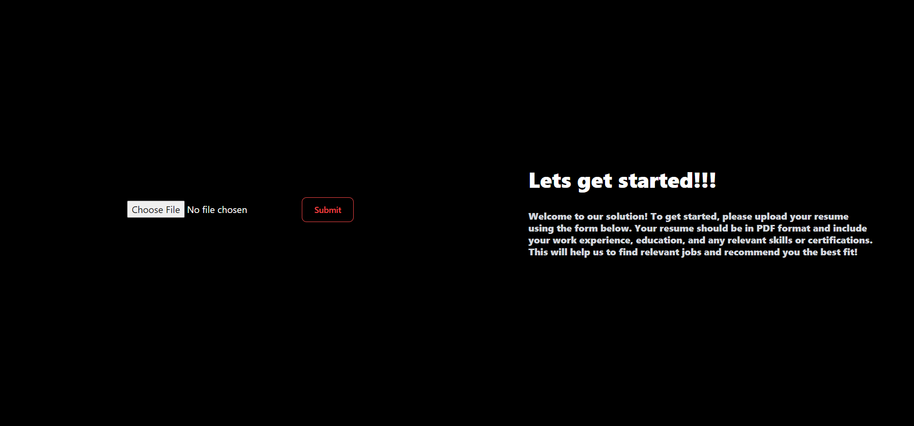

# CareerBuilder - A Job Recommendation System
In today’s competitive job market, finding the right
job can be a challenging task. To address this problem, we have
designed and implemented a job recommendation system that
helps users find their dream job by using relevant keywords
obtained from their Curriculum vitae / Resume and from
Job Postings available on websites like LinkedIn, Glassdoor,
Internshala, etc. The system is designed to provide personalized
job recommendations to users based on their skills, experience,
and career goals.
  
### What a user need to do? 
Simply sign up using your gmail id and upload your resume. It can then extract useful information from your resume (such as skills) and recommend you the suitable jobs.
 
 
### Tech Stack 
- Frontend: NextJS with Tailwind-css 
- Backend: Flask 
- Model: BERT based transformer which is pre-trained on job descriptions. On the embeddings obtained, we apply cosine similarity and rank the job based on the user resume
- Webscrapping done using selenium and geckodriver
 
 
### How to run the application (locally for testing) 
- Clone this repository 
- For the frontend folder: 
  - Run command ```npm i``` to install all dependencies
  - To start the frontend use command ```npm run dev```
- For the backend folder 
  - Install all required dependices using ```pip install -r requirement.txt ```
  - Make sure along with this you have Pytorch, numpy, pandas, sklearn installed beforehand. 
  - Also to run the backend you mandatorily need a Nvidia GPU as the embeddings cached are CUDA based and wont run on CPU only setup. 
  - Start the backend usin ```python app.py```
- Please start the backend first and then the frontend. 
- All jupyter notebooks can be found in "models and data" folder. 

For an analysis of our experiment, please go through the report.pdf avaiable in the repository. 
